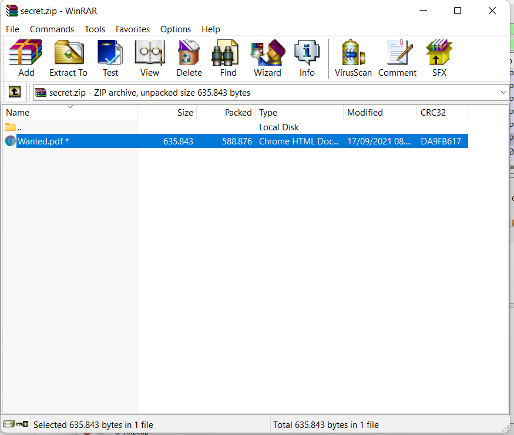
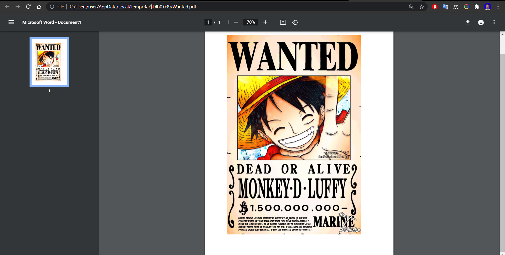

# Jarkom-Modul-1-A07-2021
Laporan resmi berisi dokumentasi soal Jarkom Modul 1.
---
Kelompok A-02:
- [Arkan Aulia Farhan](): 05111940000128
- [Muchamad Maroqi Abdul Jalil](https://github.com/maroqijalil): 05111940000143
- [Syamil Difaul Haq Sukur](https://github.com/Syamil28): 05111940000196
---

6.  Cari username dan password ketika melakukan login ke FTP Server!

Jawaban:

Display filter: **ftp.request.command == USER \|\| ftp.request.command
== PASS**

username : secretuser

password : aku.pengen.pw.aja

7.  Ada 500 file zip yang disimpan ke FTP Server dengan nama 0.zip,
    > 1.zip, 2.zip, \..., 499.zip. Simpan dan Buka file pdf tersebut.
    > (Hint = nama pdf-nya \"Real.pdf\")

Jawaban:

Display filter: **ftp-data contains Real.pdf**

Pilih salah satu package yang terfilter, klik kanan dan klik Follow \>
TCP Stream, kemudian ganti show data as "Raw" dan Save as.

Buka file "Real.pdf"

8.  Cari paket yang menunjukan pengambilan file dari FTP tersebut!

Jawaban:

Display filter: **ftp.request.command == RETR**

9.  Dari paket-paket yang menuju FTP terdapat inidkasi penyimpanan
    > beberapa file. Salah satunya adalah sebuah file berisi data
    > rahasia dengan nama \"secret.zip\". Simpan dan buka file tersebut!

Jawaban:

Display filter: **ftp-data**

Pilih salah satu package yang ditemukan, klik kanan dan klik Follow \>
TCP Stream, kemduain ganti show data as "Raw" dan Save as.

Berhasil save, lalu buka file tersebut.

10. Selain itu terdapat \"history.txt\" yang kemungkinan berisi history
    > bash server tersebut! Gunakan isi dari \"history.txt\" untuk
    > menemukan password untuk membuka file rahasia yang ada di
    > \"secret.zip\"!

Jawaban:

Dsiplat filter: **ftp-data**

Find: **"history.txt"**

Pilih salah satu package yang ditemukan, klik kanan dan klik Follow \>
TCP Stream.

Display filter: **ftp-data**

Find: **"bukanapaapa.txt"**

Pilih salah satu package yang ditemukan, klik kanan dan klik Follow \>
TCP Stream. Password file "Wanted.pdf" ditemukan, yaitu
"d1b1langbukanapaapajugagapercaya".

Buka file "secret.zip"

Buka file "Wanted.pdf" dengan memasukkan password tadi.

