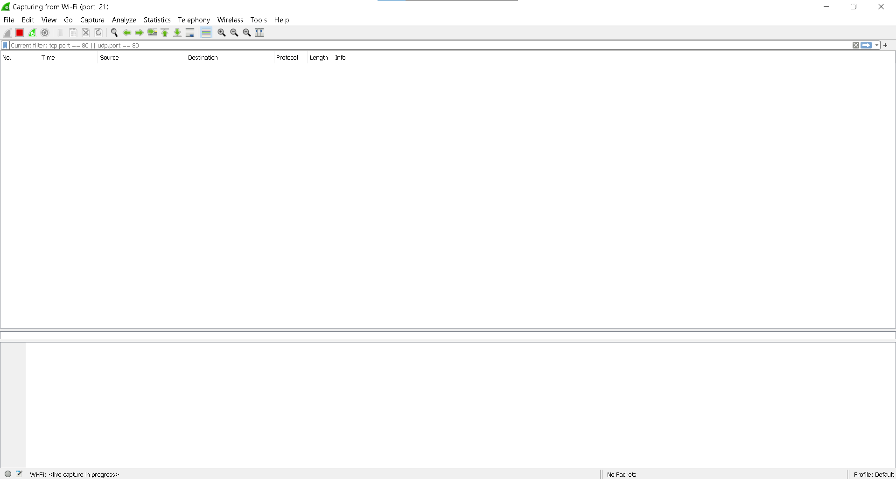

# Jarkom-Modul-1-A07-2021
Laporan resmi berisi dokumentasi soal Jarkom Modul 1.
---
Kelompok A-02:
- [Arkan Aulia Farhan](): 05111940000128
- [Muchamad Maroqi Abdul Jalil](https://github.com/maroqijalil): 05111940000143
- [Syamil Difaul Haq Sukur](https://github.com/Syamil28): 05111940000196
---

1.	Sebutkan webserver yang digunakan pada "ichimarumaru.tech"!

Jawaban: 
Webserver suatu website dapat ditemukan dengan beberapa cara, kali ini saya menggunakan wireshark untuk melihatnya. Untuk melihat webserver dari suatu website di wireshark, kita harus melihat HTTP STREAM website tersebut. pertama kita harus memfilter package website ichimarumaru.tech dulu dari package-package yang masuk ke wireshark dengan filter http.host == ichimarumaru.tech. 

setelah packagenya terfilter, pilih salah satu package lalu buka http stream dengan cara klik kanan->follow->http stream. 

akan muncul detail dari website tersebut. webserver dapat kita cek di bagian server yang dimana pada website ichimarumaru.tech, server yang digunakan adalah nginx/1.18.0 (ubuntu).

2.	Temukan paket dari web-web yang menggunakan basic authentication method!

Jawaban: 
Untuk menemukan web-web dengan basic authentication pada file 1-5.pcap digunakan filter http.authbasic. Setelah filter diaktifkan akan keluar paket-paket dengan basic authentication

3.	Ikuti perintah di basic.ichimarumaru.tech! Username dan password bisa didapatkan dari file .pcapng!

Jawaban: 
Username dan password dapat kita akses pada file 1-5.pcap dengan mencari package yang mengandung athentication. Maka seperti nomor 2, kita memfilter http.authbasic dan membuka package yang mengandung login credential.

setelah masuk, diberikan sebuah pertanyaan yang harus dijawab dan di screenshot.

4.	Temukan paket mysql yang mengandung perintah query select!

Jawaban: 
Untuk mencari query mysql digunakan filter mysql.query. akan muncul banyak query dari mysql, dan kali ini kita harus mencari query select. untuk memfilter query dibutuhkan filter matches lalu nama perintah querynya. jadi untuk menemukan yang kita cari, dibutuhkan filter mysql.query matches select.

 

5.	Login ke portal.ichimarumaru.tech kemudian ikuti perintahnya! Username dan password bisa didapat dari query insert pada table users dari file .pcap!

Jawaban: 
sama seperti nomer 4, digunakan mysql.query matches insert. lalu akan muncul username dan passwordnya

setelah masuk, diberikan sebuah pertanyaan yang harus dijawab dan di screenshot.

6.  Cari username dan password ketika melakukan login ke FTP Server!

Jawaban:

Display filter: **ftp.request.command == USER \|\| ftp.request.command
== PASS**

username : secretuser

password : aku.pengen.pw.aja

7.  Ada 500 file zip yang disimpan ke FTP Server dengan nama 0.zip,
    > 1.zip, 2.zip, \..., 499.zip. Simpan dan Buka file pdf tersebut.
    > (Hint = nama pdf-nya \"Real.pdf\")

Jawaban:

Display filter: **ftp-data contains Real.pdf**

Pilih salah satu package yang terfilter, klik kanan dan klik Follow \>
TCP Stream, kemudian ganti show data as "Raw" dan Save as.

Buka file "Real.pdf"

8.  Cari paket yang menunjukan pengambilan file dari FTP tersebut!

Jawaban:

Display filter: **ftp.request.command == RETR**

9.  Dari paket-paket yang menuju FTP terdapat inidkasi penyimpanan
    > beberapa file. Salah satunya adalah sebuah file berisi data
    > rahasia dengan nama \"secret.zip\". Simpan dan buka file tersebut!

Jawaban:

Display filter: **ftp-data**

Pilih salah satu package yang ditemukan, klik kanan dan klik Follow \>
TCP Stream, kemduain ganti show data as "Raw" dan Save as.

Berhasil save, lalu buka file tersebut.

10. Selain itu terdapat \"history.txt\" yang kemungkinan berisi history
    > bash server tersebut! Gunakan isi dari \"history.txt\" untuk
    > menemukan password untuk membuka file rahasia yang ada di
    > \"secret.zip\"!

Jawaban:

Dsiplat filter: **ftp-data**

Find: **"history.txt"**

Pilih salah satu package yang ditemukan, klik kanan dan klik Follow \>
TCP Stream.

Display filter: **ftp-data**

Find: **"bukanapaapa.txt"**

Pilih salah satu package yang ditemukan, klik kanan dan klik Follow \>
TCP Stream. Password file "Wanted.pdf" ditemukan, yaitu
"d1b1langbukanapaapajugagapercaya".

Buka file "secret.zip"

Buka file "Wanted.pdf" dengan memasukkan password tadi.

11. Filter sehingga wireshark hanya mengambil paket yang berasal dari port 80! 

Jawaban:

Capture Filter: **src port 80**

Pada filter masukkan comand **src port 80** untuk menampilkan paket yang berasal dari port 80!

12. Filter sehingga wireshark hanya mengambil paket yang mengandung port 21!

Jawaban:

Capture Filter: **port 21**

Pada filter masukkan comand **src port 21** untuk menampilkan paket yang mengandung port 21!

13. Filter sehingga wireshark hanya menampilkan paket yang menuju port 443!

Jawaban:

Capture filter: **dst port 443**

Pada filter masukkan comand **dst port 443** untuk menampilkan paket yang menuju port 21

14. Filter sehingga wireshark hanya mengambil paket yang tujuannya ke kemenag.go.id!

Jawaban:

Capture filter: **dst host kemenag.go.id**

Pada filter masukkan comand **dst port 443** untuk menampilkan paket yang menuju website kemenag.go.id.

15. Filter sehingga wireshark hanya mengambil paket yang berasal dari ip kalian!

Jawaban:

Capture filter: **src host 192.168.46.185**

Pada filter masukkan comand **src host ip(192.168.46.185)** untuk menampilkan paket yang berasal dari ip sendiri.